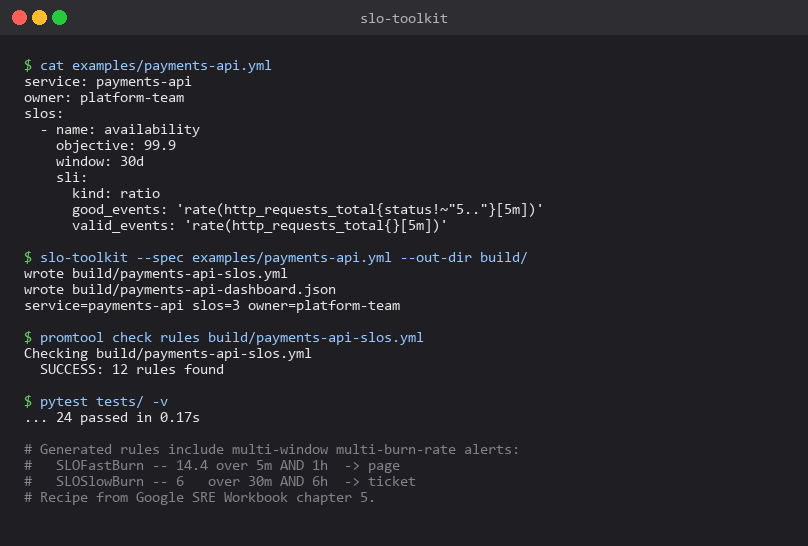

# slo-toolkit

[](https://github.com/sarteta/slo-toolkit/actions/workflows/tests.yml)
[](https://www.python.org)
[](./LICENSE)

A small CLI that turns a YAML SLO spec into:

- A Prometheus rules file with **multi-window multi-burn-rate** alerts
  (the recipe from Google's SRE workbook chapter 5).
- A Grafana dashboard JSON, one row per SLO with SLI, objective, and
  error-budget remaining panels.

Drop the generated files into your existing Prometheus + Grafana stack
and you're done. No daemon to run, no controller to install, no SaaS.



## Why I wrote this

I needed SLOs in a hurry on a contract last year — fragmented
observability, MTTR pressure, the usual — and didn't want to spin up
yet another component (Sloth, Pyrra, OpenSLO) just to manage rules.
A CLI that emits plain YAML/JSON felt about right: keep your
hand-tuned rules in the same repo, regenerate the SLO ones when the
contract changes, diff them in PRs.

## Spec example

```yaml
service: payments-api
owner: platform-team

slos:
  - name: availability
    objective: 99.9
    window: 30d
    sli:
      kind: ratio
      good_events: 'rate(http_requests_total{job="payments-api",status!~"5.."}[5m])'
      valid_events: 'rate(http_requests_total{job="payments-api"}[5m])'
    labels:
      tier: critical
      pagerduty_service: payments

  - name: latency-p95-500ms
    objective: 99
    window: 28d
    sli:
      kind: latency_threshold
      query: 'histogram_quantile(0.95, sum by (le) (rate(http_request_duration_seconds_bucket{job="payments-api"}[5m])))'
      threshold_seconds: 0.5
```

## Run

```bash
pip install -e .
slo-toolkit --spec examples/payments-api.yml --out-dir build/
```

Output:

```
build/
├── payments-api-slos.yml         # drop into prometheus rule_files
└── payments-api-dashboard.json   # import into Grafana
```

## What gets generated for each SLO

**Recording rules** — track SLI value and objective for downstream consumers:

```yaml
- record: slo:sli_value:availability
  expr: (rate(...good...) / clamp_min(rate(...valid...), 1))
- record: slo:objective:availability
  expr: 99.9
```

**Alerting rules** — the multi-window multi-burn-rate pattern:

```yaml
- alert: SLOFastBurn_availability
  expr: burn_rate_over_5m > 14.4 AND burn_rate_over_1h > 14.4
  labels: { severity: page, burn_rate: fast }

- alert: SLOSlowBurn_availability
  expr: burn_rate_over_30m > 6 AND burn_rate_over_6h > 6
  labels: { severity: ticket, burn_rate: slow }
```

The thresholds (14.4 fast, 6 slow) come from the [SRE workbook chapter 5](https://sre.google/workbook/alerting-on-slos/) and are encoded as a regression test so they don't drift.

## Validation

The example output passes `promtool check rules` cleanly:

```bash
$ promtool check rules build/payments-api-slos.yml
SUCCESS: 12 rules found
```

That check is part of CI on every push.

## Tests (24)

- Spec loading: rejects bad windows, out-of-range objectives, invalid
  names, duplicates, unknown SLI kinds, missing latency thresholds
- Prometheus output: two rule groups per SLO, correct burn-rate
  thresholds (regression-tested), labels inherited from the spec
- Grafana output: three panels per SLO, unique panel IDs, thresholds
  reflect the SLI's objective
- CLI: writes both files, `--prom-only` and `--grafana-only` flags,
  exit code 2 on bad spec

```bash
pytest tests/ -v
```

## Design choices

**One config in, two configs out.** The spec lives in your repo as
the source of truth. PR diffs show what changed. No state machine,
no controller pulling from a CRD, no extra moving piece in your
production cluster.

**Multi-window multi-burn-rate, not single-threshold alerts.** Single
threshold alerts on SLOs are noisy: either they fire constantly during
minor blips or they miss real outages. The Google recipe gives you
two windows (one short, one long) per severity, which dramatically
cuts false positives.

**Plain ratio + latency_threshold only.** Other SLI kinds (window-based,
fraction-of-buckets) are rare in practice. If you need them, the
`SLI` dataclass in `src/slo_toolkit/spec.py` is 30 lines — extend it.

**Generated rules use `clamp_min(_, 1)` on the denominator.** When
your service has zero traffic, naive ratio rules divide by zero and
emit NaN, which AlertManager treats as a flap. Clamp avoids that
without distorting real measurements.

## Roadmap

- [ ] Burn-rate alert tuning per window length (the workbook has a
      table for 28d/30d/90d combinations)
- [ ] OpenSLO compatibility — accept the OpenSLO YAML as input too
- [ ] Sloth-format export for users already on Sloth
- [ ] Datadog monitor JSON output

## License

MIT © 2026 Santiago Arteta
